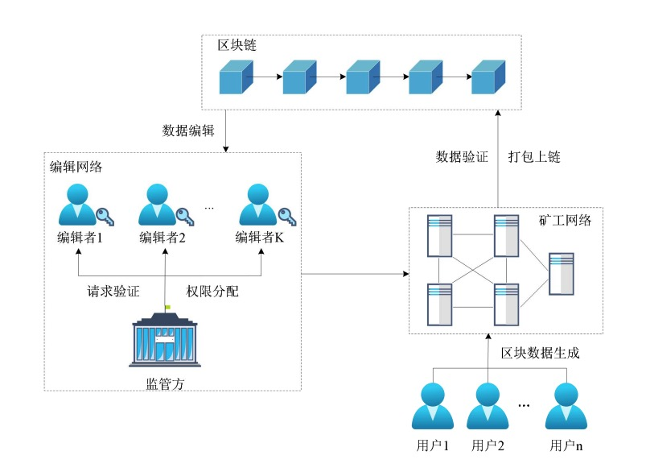

# The code in 《K-Times Redactable Blockchain with Controllable Cheating Editors》

Aiming at the problem that the immutability of traditional blockchain restricts the governance and supervision of sensitive data on the chain, this paper proposes a redactable blockchain scheme CCE-RB with controllable cheating editing. In the CCE-RB scheme, the supervisor requires editors to generate vector commitments, so as to set the number of times editors' editing permissions can be used. The editor needs to reveal each component of the vector commitment in turn before each edit to prove that he has enough redactable times. The supervisor has the right to revoke the editor's editing authority when the editor's editing times are exhausted or malicious editing behavior occurs, thus realizing the revocability of the editor's editing authority. Through the comparison and analysis of relevant schemes, CCE-RB scheme achieves the control of editors' editing permissions through the restriction of editing times, revocation of editing permissions and supervision of editing process, and avoids the occurrence of malicious editing behaviors. The security analysis shows that CCE-RB scheme satisfies the block editability, controllability of editing times and the revocability of the editing permission. The simulation results show that CCE-RB scheme has excellent operation efficiency.

